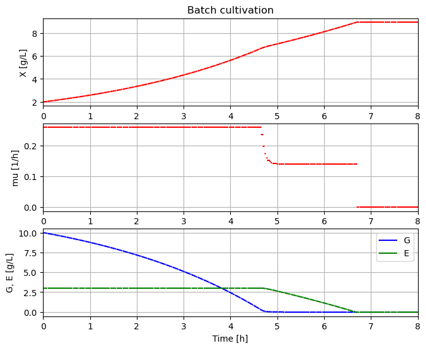

# BPL_YEAST_COB_Batch

In this example we take a closer look at different ways to represent culture metabolism and growth
and we use a simplified version of previously used bottleneck model of yeast. The model is simplified
to just show the coordinated uptake and metabolism of glucose and ethanol. The important part
of ethanol formation is dropped to simplify. The focus of the repository is to illustrate the 
idea of constrained-based modelling. This example was originally presented usering an ODE-model
but can can as well be described in terms of constraint-based modelling. The simulations are
done with FMU in combination with the Python package Optlang that is used for calculating the
the metabolic flow rates at each time instant. A so-called "Direct Approach" is used.
Below a diagram that is obtained in the notebook.

You start up the notebook in Colab by pressing here
[start BPL notebook](https://colab.research.google.com/github/janpeter19/BPL_YEAST_COB_Batch/blob/main/BPL_YEAST_COB_Batch_colab.ipynb)
or alternatively (experimentally)
[start BPL notebook with FMPy](https://github.com/janpeter19/BPL_YEAST_COB_Batch/blob/main/BPL_YEAST_COB_Batch_fmpy_colab.ipynb).
Then you in the menu choose Runtime/Run all. If you have chosen the altarnative with FMPy click first on the symbol Open in Colab.

The installation takes just a few minutes. The subsequent execution of the simulations of microbial growth take just a second or so. You can continue in the notebook and make new simulations and follow the examples given.

See also the related repositories: BPL_YEAST_AIR_Fedbatch.

Note that:
* The script occassionaly get stuck during installation. Then just close the notebook and start from scratch.
* Remember, you need to have a google-account!

Just to be clear, no installation is done at your local computer.

License information:
* The binary-file with extension FMU is shared under the permissive MIT-license
* The other files are shared under the GPL 3.0 license

 
